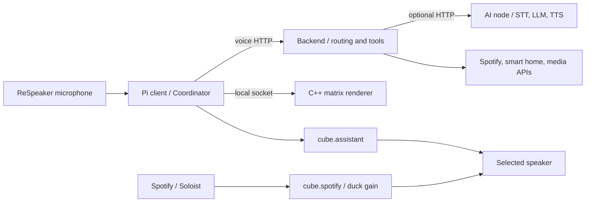

# Cube

**A voice-operated Raspberry Pi 5 assistant with a 64×64 RGB matrix.**

I designed and built Cube's physical device and software, including a custom enclosure with an acoustic chamber. A ReSpeaker microphone captures voice, the matrix presents information, and separate services coordinate speech, local controls, smart-home integrations and Spotify playback.

## Display previews

  
  
  

Original animation samples included with the source. The display also runs a clock, weather and Spotify artwork/progress apps.

## Main features

- **Voice interaction:** wake-word detection, speech recognition, spoken replies and interruption/barge-in. A new wake replaces the active interaction.
- **Deterministic controls:** explicit device and music commands run through validated backend tools without LLM interpretation.
- **Optional AI processing:** a separate node provides remote STT, interpretation and TTS; the backend retains local speech fallbacks, with Piper fallback on the Pi.
- **Spotify Connect:** a separately installed Soloist receiver handles playback. Music and assistant audio use independent PipeWire buses, volume controls and interaction-driven ducking.
- **Smart home and media:** configured Govee lights, Tuya plugs, Overseerr requests and authenticated Radarr/Sonarr notifications.
- **Matrix display:** clock, weather, original animations and music share a native renderer with voice overlays and content transitions.

## Architecture

## Hardware

Raspberry Pi 5, a 64×64 HUB75 RGB matrix, ReSpeaker microphone/audio hardware and a speaker sit within a custom enclosure with an acoustic chamber. The matrix backend uses the Pi 5 RP1 PIO path. Capture channels, panel wiring, speaker routing and echo behavior require hardware-specific commissioning. [Hardware overview](docs/HARDWARE.md) describes the scope and verification limits.

## Software architecture

Three independently deployable Python services communicate over HTTP. The Pi owns real-time capture, playback and physical effects. The backend owns validated tool execution, integrations and durable media state. The optional AI node supplies inference and cannot execute hardware commands directly. Each service has its own environment and assets; runtime modules do not import another service.

The C++17 display process alone owns panel output. Keeping it independent of network and inference work protects rendering from those delays. [Architecture reference](docs/ARCHITECTURE.md).

## Voice system

The Coordinator owns interaction generations, recording and follow-up. Async HTTP/audio workers report completion to that owner. Barge-in cancels owned work, reaps audio subprocesses and rejects stale results. Reboot/shutdown require a matching completed spoken acknowledgment. Cancellation cannot undo a command already sent to an external device. [Voice lifecycle and validation](docs/VOICE_BARGE_IN.md).

## Display system

A carousel schedules available clock, weather, animation and music apps. Explicit content and voice overlays compose through the same renderer. Weather and music providers prepare bounded snapshots outside the frame loop; stale data expires. [Display architecture](docs/DISPLAY_ARCHITECTURE.md).

## Spotify and audio

Soloist runs on the Pi; the backend's MusicController owns Spotify Web API operations and state. Deterministic music commands use that same controller. Assistant speech and music reach the selected speaker through separate buses, so ducking music does not change assistant volume. Spotify credentials remain private, and the receiver is obtained separately. [Spotify setup and contracts](docs/SPOTIFY.md).

## Repository

| Path | Responsibility |
| --- | --- |
| `client/app/` | Pi voice lifecycle, audio, hardware controls and display providers |
| `client/native/` | C++ matrix renderer and hardware-free rendering logic |
| `client/deploy/` | Pi systemd/polkit templates and audio configuration |
| `server/` | Backend routing, integrations, speech fallbacks and media state |
| `ai_node/` | Optional inference service and Windows/WSL launchers |
| `config/` | Canonical command catalog and placeholder configuration examples |
| `tests/` | Component, native and cross-service contract tests |
| `scripts/`, `tools/` | Repository checks, deployment rendering and offline asset tools |
| `docs/` | Setup, architecture and operation |

## Development and setup

Start with the [hardware-free test guide](tests/README.md): client, backend, mocked AI-node and integration suites have separate CPU dependency manifests. Native unit tests use an inert panel facade. CI runs the four suites and catalog/documentation checks.

For deployment, follow [setup](docs/SETUP.md). Supply your own compatible wake model, speech assets and private configuration. This source repository does not redistribute the custom “Hey Cube” model, speech/LLM weights or Soloist binaries. The tests do not require those assets.

## Limitations

Cube is a personal hardware project with manual provisioning. Voice operation needs the Pi's wake/Piper assets and a reachable, provisioned backend. AI inference is optional; Spotify and cloud integrations need internet access and their own accounts. Acoustic echo cancellation, Bluetooth, panel timing and upstream GPU cancellation require physical validation. HTTP services belong on a trusted network. See [security](SECURITY.md) and [validation status](docs/PROJECT_STATUS.md).

## License

Original Cube source and original animation samples are [MIT licensed](LICENSE). The matrix dependency and its patch retain their own terms; fonts retain their attribution. The root license does not relicense third-party components. See [third-party notices](THIRD_PARTY_NOTICES.md).
