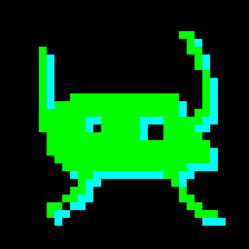

# Cube

Cube is a Raspberry Pi home project I built to combine voice controls, music, and a small LED display in one device. I designed and 3D-printed the enclosure, including the speaker’s acoustic chamber, and put together the software for voice interaction, Spotify playback, smart-home controls, and the display apps.

It uses a Raspberry Pi 5, a ReSpeaker microphone, a speaker, and a 64×64 RGB matrix.

## What it does

- Wake-word detection, spoken replies, and interruption (barge-in) when I start a new interaction.
- Deterministic voice commands for supported device and music controls.
- Spotify Connect playback through a separately installed Soloist receiver, with independent music and assistant volume controls and music ducking during interactions.
- Controls for configured Govee lights and Tuya plugs, plus media requests and notifications.
- Clock, weather, animation, and music display apps, including album artwork and playback progress.

Cat and alien animation previews:

  
  

## How it runs

The **Pi** handles the microphone, wake word, audio playback, and physical controls. A separate C++ process drives the matrix.

The services communicate over HTTP and have separate Python environments and assets.

The **backend** handles voice requests, command execution, Spotify control, and smart-home integrations. The **optional AI node** provides speech recognition, language-model interpretation, and speech synthesis. Supported deterministic music commands do not require the AI node; the backend has local speech fallbacks.

## Setup and development

This repository reflects my personal setup. Running it requires suitable hardware, configuration, accounts for the integrations you use, and separately supplied models. It is not a plug-and-play product.

- [Setup](docs/SETUP.md)
- [Rebuild and restart the client](client/deploy/README.md#rebuild-and-restart-the-client)
- [Testing and development](tests/README.md), including hardware-free tests
- [Hardware](docs/HARDWARE.md)
- [Architecture](docs/ARCHITECTURE.md), with details on [voice](docs/VOICE_BARGE_IN.md), [display](docs/DISPLAY_ARCHITECTURE.md), and [Spotify](docs/SPOTIFY.md)
- [Security](SECURITY.md) and [testing limits](docs/PROJECT_STATUS.md)

## License

Original Cube source uses the [MIT license](LICENSE). Included third-party code and assets keep their own licenses and attribution; see [third-party notices](THIRD_PARTY_NOTICES.md).
